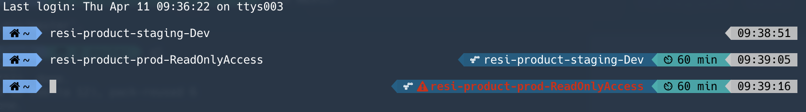

# aws-timer

Small shell script to be used with Powerlevel9K ZSH configuration.



It will:
- Print out the AWS Role you are currently authenticated with
- Make it obvious if that role is for a production account (so you can be super careful)
- Tell you how much time remains for the current AWS session

## Pre-requisites
- [Powerlevel9K](https://github.com/bhilburn/powerlevel9k)
- [Nerd Fonts](https://nerdfonts.com)

## Usage
1. clone this repo
   ```bash
   $ git clone git@git.realestate.com.au:dave-greig/aws-timer.git ~/.aws-timer
   ```
2. source the script in your `~/.zshrc` file
   ```bash
   source ~/.aws-timer/timer.sh
   ```
3. create a custom segment for Powerlevel9k (in `~/.zshrc`) and add it to LEFT or RIGHT PROMPT
    ```
    POWERLEVEL9K_CUSTOM_AWS_TIMER_BACKGROUND=037
    POWERLEVEL9K_CUSTOM_AWS_ROLE_BACKGROUND=024
    POWERLEVEL9K_CUSTOM_AWS_TIMER=awsTimeRemaining
    POWERLEVEL9K_CUSTOM_AWS_ROLE=awsRoleMessage
    POWERLEVEL9K_LEFT_PROMPT_ELEMENTS=(root_indicator dir nvm rbenv vcs)
    POWERLEVEL9K_RIGHT_PROMPT_ELEMENTS=(status background_jobs command_execution_time custom_aws_role custom_aws_timer time)
    ```

Colour code reference can be found [here](https://github.com/bhilburn/powerlevel9k/wiki/Stylizing-Your-Prompt#segment-color-customization).
